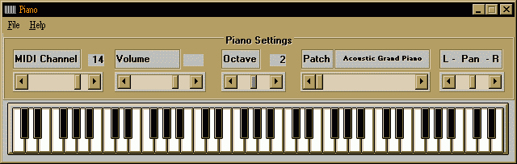



## VbPiano \- Really Cool

### Description

This is a very cool MIDI piano coded in VB. You can define everything in this sample. Have fun!
 
### More Info
 

             |
---                |---
**Submitted On**   |1995-08-25 12:59:26
**By**             |[bbence](https://github.com/Planet-Source-Code/PSCIndex/blob/master/ByAuthor/bbence.md)
**Level**          |Intermediate
**User Rating**    |4.7 (14 globes from 3 users)
**Compatibility**  |VB 5\.0, VB 6\.0
**Category**       |[Miscellaneous](https://github.com/Planet-Source-Code/PSCIndex/blob/master/ByCategory/miscellaneous__1-1.md)
**World**          |[Visual Basic](https://github.com/Planet-Source-Code/PSCIndex/blob/master/ByWorld/visual-basic.md)
**Archive File**   |[CODE\_UPLOAD48264152000\.zip](https://github.com/Planet-Source-Code/bbence-vbpiano-really-cool__1-7296/archive/master.zip)

